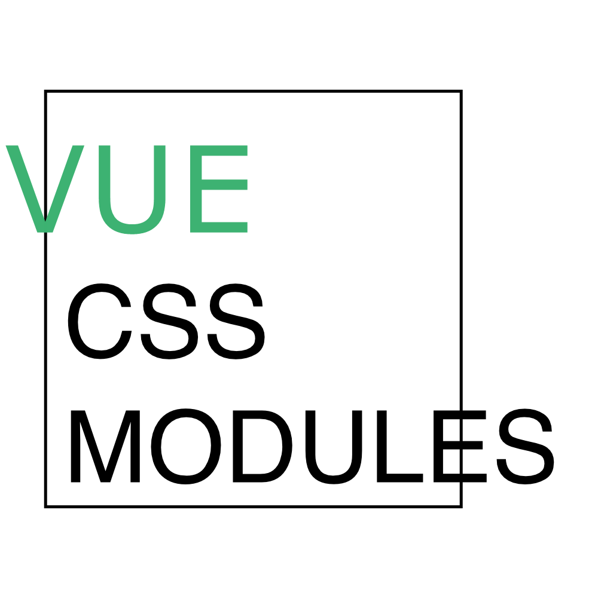

# Vue CSS Modules



## CSS Modules：局部作用域 & 模块化

`CSS Modules` 为每一个局部类名产生全局唯一的类名，这样组件样式间就不会相互影响了。如：

```css
/* button.css */
.button {
  font-size: 16px;
}
.mini {
  font-size: 12px;
}
```

它会被转换为类似这样：

```css
/* button.css */
.button__button--d8fj3 {
  font-size: 16px;
}
.button__mini--f90jc {
  font-size: 12px;
}
```

当导入一个 CSS 模块文件时，它会将局部类名到全局类名的映射对象提供给我们。就像这样：

```javascript
import styles from './button.css'
// styles = {
//   button: 'button__button--d8fj3',
//   mini: 'button__mini--f90jc'
// }

element.innerHTML = '<button class="' + styles.button + ' ' + styles.mini + '" />'
```

## Vue CSS Modules：简化类名映射

下面是一个使用了 CSS Modules 的按钮组件：

```html
<template>
  <button :class="{
    'global-button-class-name': true,
    [styles.button]: true,
    [styles.mini]: mini
  }">点我</button>
</template>

<script>
  import styles from './button.css'

  export default {
    props: { mini: Boolean },
    data: () => ({ styles })
  }
</script>
```

的确，CSS Modules 对于 Vue 组件是一个不错的选择。但也存在以下几点不足：

- 你必须在 `data` 中传入 `styles`
- 你必须使用 `styles.localClassName` 导入全局类名
- 如果有其他全局类名，你必须将它们放在一起
- 如果要和组件的属性值绑定，就算局部类名和属性名一样，也要显式指定

对于上面的按钮组件，使用 `vue-css-modules` 后：

```html
<template>
  <button
    class="global-button-class-name"
    styleName="button :mini">
    点我
  </button>
</template>

<script>
  import CSSModules from 'vue-css-modules'
  import styles from './button.css'

  export default {
    mixins: [CSSModules(styles)],
    props: { mini: Boolean }
  }
</script>
```

现在：

- 你不必在 `data` 中传入 `styles`，但得在 `mixins` 中传入 `styles` 🌝
- 你可以跟 `styles.localClassName` 说拜拜了
- 将局部类名放在 `styleName` 属性，全局类名放在 `class` 属性，规整了许多
- 局部类名绑定组件同名属性，只需在其前面加上 `:` 修饰符

## 修饰符

### **@** button

```html
<button styleName="@button">按钮</button>
```

这等同于：

```html
<button styleName="button" data-component-button="true">按钮</button>
```

### **$** type

```html
<button styleName="$type">按钮</button>
```

这等同于：

```html
<button :styleName="this.type">按钮</button>
```

### **:** mini

```html
<button styleName=":mini">按钮</button>
```

这等同于：

```html
<button :styleName="this.mini ? 'mini' : ''">按钮</button>
```

### disabled **=** isDisabled

```html
<button styleName="disabled=isDisabled">按钮</button>
```

这等同于：

```html
<button :styleName="this.isDisabled ? 'disabled' : ''">按钮</button>
```
